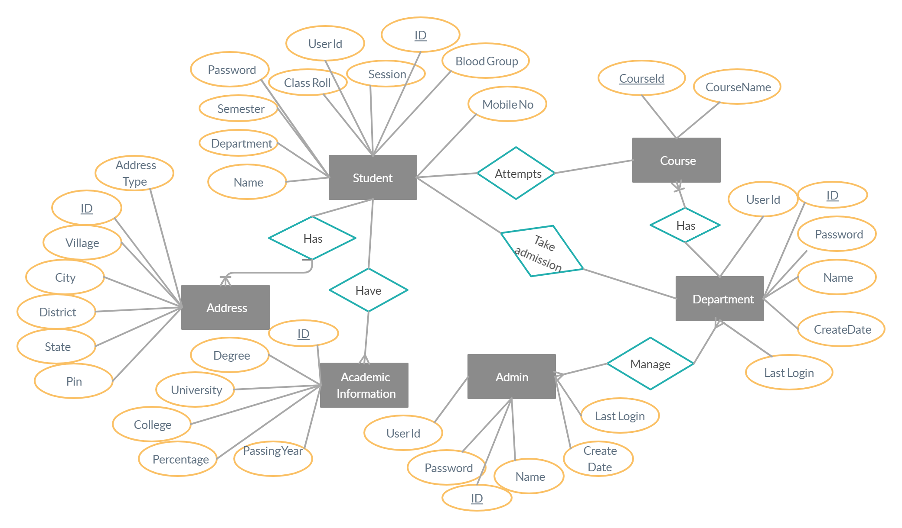

<h1 align="center">Student Information Management System</h1>
  <h3>Technologies Used: </h3>
  <ul>
    <li>
      
<b>Front End:</b> HTML 5, Bootstrap 4, CSS, Java Script

    </li>
    <li>
      
<b>Back End:</b> Django 3.0

    </li>
    <li>
      
<b>Database:</b> PostgreSQL

    </li>
  </ul>
  <h3 align="center">ER-DIAGRAM</h3>
  

    
  

  <h3>Scope: </h3>
  

    Student Information system will store all the details of the students
    including their background information, educational qualifications,
    personal details and all the information related to their resume
  

<ul>
    <li>Registration Module and Account Management:</li>
    <ul>
      <li>This module will help the student get registered from anywhere if
        internet is present .This module will really simplify the task of on paper
        registration. Also after successful registration the user can update
        information and change their password as and when required.</li>
    </ul>
    <li>Login module:</li>
    <ul>
      <li>Login module will help in authentication of user accounts .Users who
        have valid login id and password can only login into their respective
        accounts.</li>
    </ul>
    <li>Send Mail:</li>
    <ul>
      <li>This module will help the admin and the department to send mail to a
        specific or a group of students.</li>
    </ul>
    <li>Search module:</li>
    <ul>
      <li>Suppose there are hundreds of students and from this we have to
        search a particular student and we know the name of the student .In
        manual system it is a tedious task though we know the name of the
        student, but using this module we can easily search the student by
        specifying the name of the student in the search criteria. Thus this
        module will help the administrator in searching the student with various
        criteria easily.</li>
    </ul>
<li>Search module:</li>
    <ul>
      <li>Suppose there are hundreds of students and from this we have to
        search a particular student and we know the name of the student .In
        manual system it is a tedious task though we know the name of the
        student, but using this module we can easily search the student by
        specifying the name of the student in the search criteria. Thus this
        module will help the administrator in searching the student with various
        criteria easily.</li>
    </ul>
   
  </ul>
  <h3>User Role:</h3>
  <li><b>Student:</b></li>
  <ul>
    <li>
      
First student will sign up with a valid Email id. After signing up, an
        activation link will be sent to the email id. When their account is active
        they can login and fill their details and submit. After submitting their
        details students can only see their details, until the Department or Admin
        can not unlock their details.If their details is unlocked they can update
        their details.

    </li>
  </ul>
  <li><b>Admin:</b></li>
  <ul>
    <li>
      
First admin will sign up their account. Admin no need for their account
        approval. After login they can create a Departmental account for
        verifying students details and many other operations. Admin can see all
        types of students' ( current,pass out,deleted ) records with their details
        and filter by their Department name,semester and session, and can also
        download as pdf if required. They can update,delete,lock,unlock any
        verified student details. They can also send mail to a particular student
        or group of students.

    </li>
  </ul>
  <li><b>Department:</b></li>
  <ul>
    <li>
      
First Department will activate their account which is created by the
        admin. After activation, the Department name will be added.
        Department can see all the students' records and verify them after
        seeing if all the information is correct otherwise if the information is fake
        then the department can delete the records. Department can see only its
        own department’s current and pass out students records and can
        perform updates,delete,lock,unlock,send mail with their details. If
        required, the Department can download students records and can search
        by semester or/and class roll number.

    </li>
  </ul>
  <h3>Registration Page</h3>
  
  <h3>Login Page</h3>
  
  <h3>Admin Home Page</h3>
  
  <h3>Department Home Page</h3>
  
  <h3>Students Info Page</h3>
  
